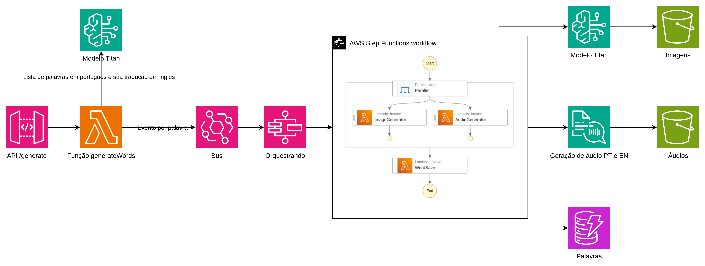
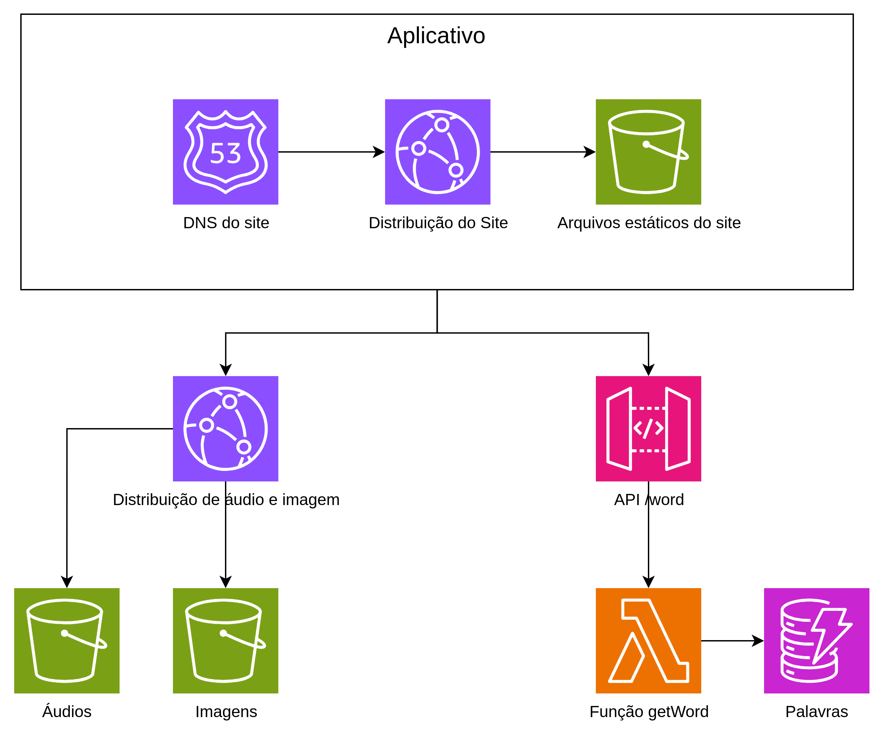

I'm a father of two kids; currently, they are 8 and 6 years old.

Last year, I received an invite to participate in the AWS Global Heroes Summit, a yearly meeting of all AWS Heroes from around the world.

Happily, the meeting was scheduled to take place during the kids' vacation here in Brazil, so it was an easy decision to have our family vacation together in Seattle, WA—the city where the event was held.

My kids love learning new languages and having new experiences when traveling. When we traveled to Argentina, they wanted to learn some words and sentences in Spanish. When we told them we were traveling to the US, they wanted to learn more English.

The school where they study has English classes every day, but we knew they needed to practice more before the trip to be better prepared.

Here is where I, as the nerd that I am, stepped in: how could I use technology to help with that? Especially Serverless and GenAI. And that’s how this project started.

The Idea
The idea was very simple. What if I created a memorization app for my kids? But I didn’t want to manually think about the words, images, or speech.

With this in mind, I built an app that generates everything automatically. I just need to specify the type of words I want, for example, "animals" or "vehicles," and everything is created—including the words (both in English and Portuguese), the images, and the speech in both languages.

The app works like this: my kids see an image and an English word. When they click on it, they hear the word in English. If they click on the "card," the word changes to Portuguese, and clicking it again plays the pronunciation in Portuguese. That simple.

It’s a low-cost way to memorize English words while also learning more about AWS services.

## Loading Words into the Database

First of all, to use the app, you need to load words into the database.

I created an endpoint that generates words based on what I request using GenAI. A Lambda function calls the Bedrock service to generate words in English along with their Portuguese translations, so I get a pair of words—a word and its translation.

Because I want these words to be generated and saved quickly in my database, I send each word pair as an event to EventBridge.

Then, I use Step Functions to handle the rest. In that workflow, I create an image for each word as well as speech for both words.

For image generation, I use GenAI through Bedrock. For speech, I use Polly. Both images and audio files are saved in S3 buckets.

Afterward, all the data is saved in a DynamoDB table.

Here’s the app architecture:

I'm serving images and audio through CloudFront with caching enabled.

I have an endpoint that retrieves a random word from the database and displays it to the user. Since I need to fetch a random word, I use a Lambda function between API Gateway and the DynamoDB table.

Finally, I have a simple JavaScript page hosted on S3 and served via CloudFront.

You can try it out on our demo website, where everything is running: https://mee-moo.com